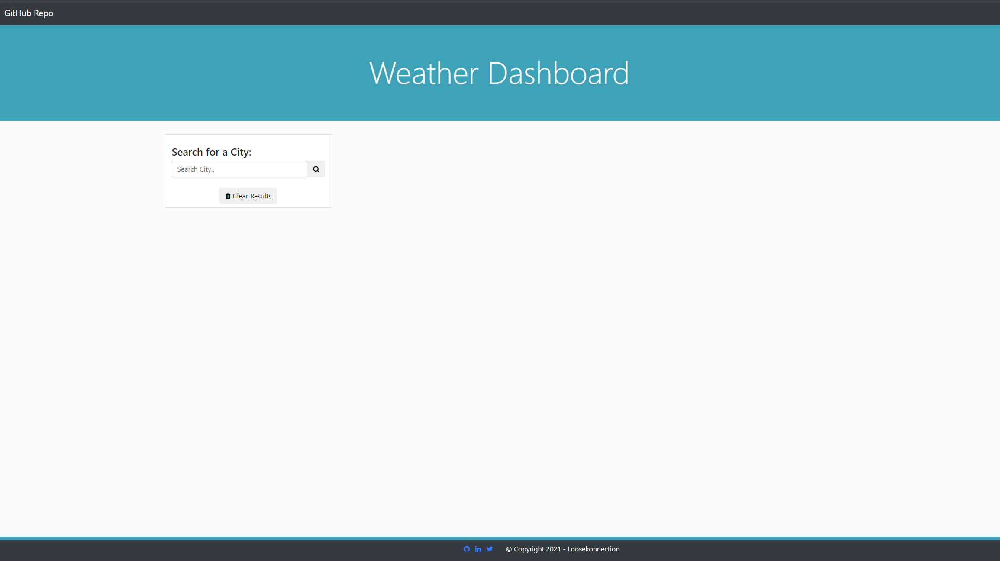
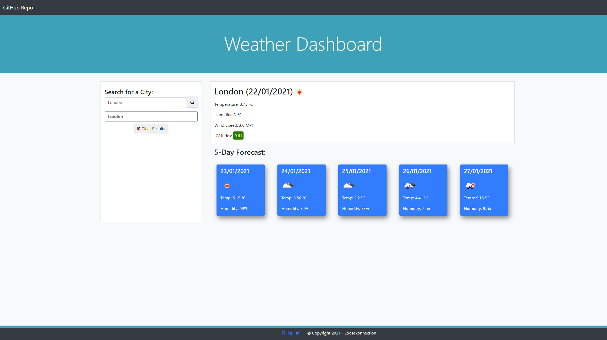

# Weather Dashboard
Weather Forecast Dashboard

*   GitHub Repository [weatherDashboard](https://github.com/Loosekonnection/weatherDashboard)
*   GitHub Pages URL [Weather Dashboard Webpage](https://loosekonnection.github.io/weatherDashboard/)
---

 

## Pseudo Code
 

*   The weather dashboard is to provide the current day's weather as well as a 5 day forecast.
*   To acheieve this it will require an API weather provider, for this I have used:

    *   [OpenWeather API](https://openweathermap.org/api)

*   From the API data I need to capture:

    *   Weather Image
    *   Temperature  
    *   Humidity
    *   Wind Speed
    *   UV Index (colour coded)

*   The webpage will need a search field for the end user to type a city name in. 
*   When the end user searches for a city, the city name will need to be shown in a search history area as a button.
*   The city name in the search area should then be clickable to return the weather back to the web page, if a user has searched for additional cities.
*   The current day's weather should be dynamically displayed to the right of the search area within its own area/frame.
*   The 5-day summary forecast should be presented below the current day.
*   Each of the days ahead needs to be clearly seperated out in to cards to make each day easily identifiable. 
*   Each of the 5-day summary cards should contain:

    *   Weather Image
    *   Temperature
    *   Humidity

*   The end user must be able to clear the results history, a 'Clear Results' button will need to be generated.
*   On a relaod of the page the search history must be persistent, and display the last searched city's weather data.
---

 

## Technolgies Used

*   HMTL [w3schools.com Learn HTML](https://www.w3schools.com/html/default.asp)
*   CSS [w3schools.com Learn CSS](https://www.w3schools.com/css/default.asp)
*   Boostrap [w3schools.com Bootstrap4 Tutorial](https://www.w3schools.com/bootstrap4/default.asp)
*   JavaScript [w3schools.com JavaScript Tutorial](https://www.w3schools.com/js/default.asp)
*   jQuery [w3schools.com jQuery Tutorial](https://www.w3schools.com/jquery/default.asp)
---

 

## Using the Weather Dashboard
 

*   On arrival to the weather dashboard webpage you will be presented with a 'Search for a City' input field.

 

---

 

*   Type a city name into the 'Search for a City' field and click the search button.
*   This will return the weather details for that city.
*   To clear the search history click the 'Clear Results' button, this will reset the webpage.

 

---

 

## Credits

*   University of Birmingham [Coding Boot Camp](https://bootcamp.birmingham.ac.uk/coding/).
*   Modern JavaScript (Novice to Ninja) [The Net Ninja](https://www.thenetninja.co.uk/courses/modern-javascript-tutorial).
*   Most of the answers to my research on this project have come from [Stack Overflow](https://stackoverflow.com/).
*   For syntax help when finding a solution elsewhere [w3schools.com](https://www.w3schools.com/jsref/default.asp) is and has been a fantastic reference guide to use along with Stack Overflow.
*   Everything you need to know about Local Storage [localStorage](https://www.boldare.com/blog/everything-you-need-to-know-about-local-storage/).

---
 

 

---
© 2021 Loosekonnection, Working towards being a Full Stack Developer.